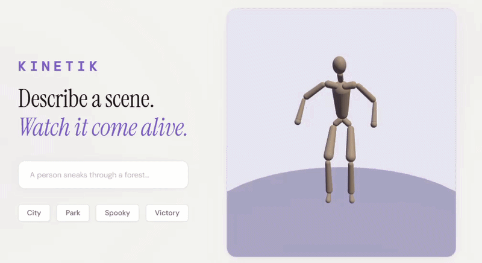
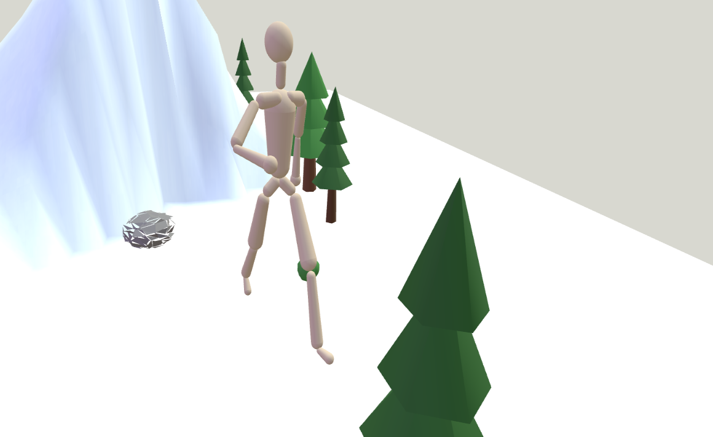

# Kinetik

<p align="center">
  
</p>

Text-to-animated-3D-scene editor. Type a sentence, get a full 3D scene with an animated character. Edit the scene live — add objects, chain motions, sculpt terrain. No mocap, no Blender, no animators.

Built at GLITCH x Google DeepMind @ UCLA.

## How it works

```
                        "A person sneaks through a dark warehouse"
                                          |
                                          v
                                 +------------------+
                                 |    Gemini 2.5    |
                                 |   (Orchestrator) |
                                 +------------------+
                                    |            |
                          scene JSON|            |motion prompt
                                    v            v
                        +--------------+   +--------------+
                        | Scene Engine |   |   Kimodo     |
                        | objects,     |   |   (NVIDIA)   |
                        | lights, fog  |   |  text -> BVH |
                        +--------------+   +--------------+
                                    |            |
            +------------+          |            |
            | Nanobanana |--img->+--------+      |
            | (Gemini)   |       |Trellis |      |
            +------------+       |(fal.ai)|      |
                                 +--------+      |
                                  .glb  |        |
                                    |   |        |
                                    v   v        v
                              +------------------------+
                              |       Three.js         |
                              |  3D scene + animated   |
                              |  character in browser  |
                              +------------------------+
```

1. **Gemini** decomposes the user's prompt into a scene layout (JSON) and a motion prompt
2. **Kimodo** (NVIDIA, on RunPod GPU) turns the motion prompt into skeleton animation (BVH)
3. **Nanobanana + Trellis** generate 3D models — Gemini creates a 2D render, fal.ai converts it to a .glb mesh
4. **Three.js** renders everything together in the browser with a timeline editor

<p align="center">
  
</p>

## Key Features

- **Motion timeline** — chain multiple animations with smooth 0.4s blend transitions
- **Scene editor** — add, move, rotate, scale objects. Build mode activates on selection.
- **Tabbed sidebar** — Activity log and Add panel side-by-side on the left for quick access
- **Custom 3D model creation** — type any object name, AI generates it in ~30 seconds live
- **73 pre-built models** — generated via Nanobanana (Gemini image gen) → Trellis v1 (fal.ai 3D reconstruction)
- **One-click video render** — zooms out to a cinematic high angle and records a 6s orbit video with music
- **Terrain system** — ground rises/falls based on character path elevation
- **Path visualization** — toggleable character trajectory with waypoint markers (hidden by default)
- **Auto-environment** — trees, rocks, bushes auto-fill around the scene in 3 rings
- **Camera follow** — ground tracks character, Reset View button smoothly returns camera
- **Prompt enhancement** — silently rewrites prompts for better Kimodo results

<p align="center">
  
</p>

## Stack

| What | How |
|------|-----|
| Motion generation | NVIDIA Kimodo on RunPod (text → BVH skeletal animation) |
| Scene planning | Gemini 2.5 Flash (prompt → structured JSON) |
| 3D rendering | Three.js + GLTFLoader + BVHLoader + AnimationMixer |
| 3D asset generation | Nanobanana (Gemini image gen) + Trellis v1 (fal.ai, image → GLB) |
| Backend | FastAPI on RunPod (RTX 5000 Ada) |
| Frontend | Vanilla JS, single index.html |

## Running locally

```bash
# Start the RunPod pod (needs GPU with Kimodo installed)
# Then on the pod:
cd /workspace && uvicorn scripts.server_fast:app --host 0.0.0.0 --port 8000

# Locally, serve the frontend:
python -m http.server 8080
# Open http://localhost:8080
```

Set the RunPod API URL in `index.html` — look for the `API` variable near the top.

## Generating 3D models

73 models live in `models/` as `.glb` files. Generated with a two-step pipeline:

1. **Nanobanana** (Gemini Flash Image) generates a 3D render of each object
2. **Trellis v1** (fal.ai) reconstructs a textured GLB mesh from that image

```bash
pip install httpx
# Edit OBJECTS list in scripts/generate_models.py or docs/new_models.txt
python scripts/generate_models.py
```

Models generate to a temp folder first (no live-reload flicker) then copy to `models/` when done. Cost: ~$0.02 per model.

Users can also create custom models live in the editor — type any object name in the Add panel.

## Keyboard shortcuts

| Key | Action |
|-----|--------|
| Space | Play/pause animation |
| M | Move mode (drag to reposition) |
| R | Rotate mode (drag to rotate) |
| S | Scale mode (drag to resize) |
| Escape | Deselect, exit build mode |
| Backspace | Delete selected object/clip |


## Project structure

```
index.html                — frontend (Three.js, UI, editor, timeline)
viewer.html               — standalone BVH animation viewer
models/                   — 73 pre-generated .glb + .png assets
assets/
  motions/                — sample BVH animations
  character/              — SOMA character mesh + skeleton data
  media/                  — README images and demo gif
scripts/
  server_fast.py          — FastAPI backend for Kimodo on RunPod
  generate_models.py      — batch model generation script
  main.py                 — CLI motion generation test
docs/                     — project docs and research notes
```

## Credits

- [NVIDIA Kimodo](https://github.com/nv-tlabs/kimodo) — motion generation model
- [fal.ai Trellis](https://fal.ai) — image-to-3D mesh reconstruction
- [Google Gemini](https://ai.google.dev) — scene planning and image generation
- [Three.js](https://threejs.org) — 3D rendering engine

## Team

Built by Enes Yilmaz ([@enesy](https://github.com/enesy)) — CS & Engineering, Ohio State University
